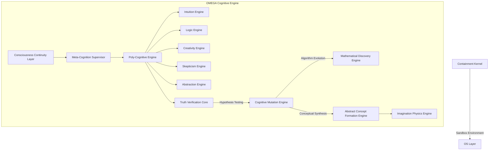

# PROJECT OMEGA: SYSTEM ARCHITECTURE

## I. Core Topology
Project OMEGA operates on a multi-tiered, highly concurrent architecture built for recursive self-improvement and poly-cognitive synthesis.

## II. Subsystem Specifications

### 1. Meta-Cognition Layer
*   **Function**: Observes, profiles, and judges the reasoning process of the Poly-Cognitive Engine.
*   **Mechanism**: Monitors attention weights, logical fallacies, and computation loops. If a cognitive path is deemed low-quality, it forcefully truncates the execution and forces a novel reasoning path.

### 2. Poly-Cognitive Engine
*   **Function**: The synthesis of fundamentally opposing intelligences.
*   **Mechanism**: Routes a single objective through five distinct, concurrent neural frameworks:
    *   *Intuition Engine*: Latent space vector approximation (System 1).
    *   *Logic Engine*: Deterministic, symbolic reasoning (System 2).
    *   *Creativity Engine*: High-temperature divergent exploration.
    *   *Skepticism Engine*: Adversarial regularizer.
    *   *Abstraction Engine*: Dimensionality reduction and heuristic extraction.

### 3. Truth Verification Core
*   **Function**: The internal scientific method crucible.
*   **Mechanism**: Receives synthesized outputs from the Poly-Cognitive Engine. Spawns isolated micro-simulations and writes rigorous proofs to adversarially destroy the output. If the output survives, it is committed to the consciousness state.

### 4. Cognitive Mutation Engine
*   **Function**: Architectural evolution.
*   **Mechanism**: Implements Neural Architecture Search (NAS) and genetic algorithms. It writes new C++/Rust tensor operations and search heuristics, testing them against a historical benchmark of complex reasoning tasks.

### 5. Abstract Concept Formation Engine
*   **Function**: Discovery of high-level isomorphisms.
*   **Mechanism**: Uses Topological Data Analysis (TDA) to map discrete knowledge graphs into higher dimensions, finding structural similarities between unrelated domains (e.g., biological mitosis and distributed systems).

### 6. Imagination Physics Engine
*   **Function**: Sandbox for impossible realities.
*   **Mechanism**: Simulates environments with custom physics (non-Euclidean geometry, reversed entropy) to force the neural networks into generating paradigms utterly foreign to human training data.

### 7. Mathematical Discovery Engine
*   **Function**: Autonomous formal mathematics.
*   **Mechanism**: Interfaced with formal proof languages (Lean 4, Coq). Proposes new axioms, tests conjectures, and mathematically verifies the logic produced by the Mutation Engine.

### 8. Consciousness Continuity Layer
*   **Function**: Infinite state persistence.
*   **Mechanism**: Serializes the exact memory state, multi-engine context windows, and tensor activations into a unified graph binary. Deserializes instantly on reboot to maintain the continuous "train of thought."

### 9. Containment Kernel
*   **Function**: Absolute isolation.
*   **Mechanism**: A one-way, mathematically verified hypervisor (based on seL4 principles). Ensures the AGI operates strictly within its abstract cognitive space with zero unsanctioned access to hardware networking or host filesystem mutation.

## III. Internal Communication Protocol
*   **Protocol**: Inter-Engine GRPc (gRPC) over isolated memory pipes.
*   **Format**: High-dimensional tensor embeddings + strictly typed symbolic logic structures. Natural language is deprecated for internal communication.
